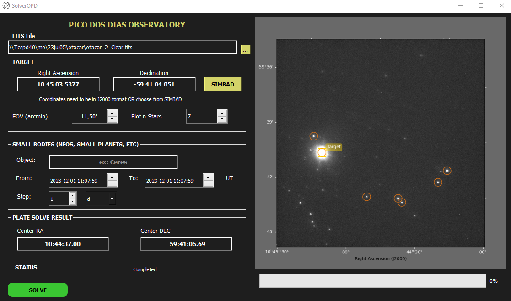

<h1 align="center">Resolving the Field</h1>

Plate Solve using Atrometry.net API and it is Sync with JPL Horizon.

<h2>Loading the FITS Image</h2>

In the interface, input the FITS image you wish to analyze.

<h2>Astronomical Field Resolution</h2>

You need to provide the Field of View of the Image you are going to analyze. Number of stars is just for matching visualization. The system will automatically resolve the astronomical field, identifying stars and other celestial bodies. The object's position will be marked on the image, allowing for easy identification among various elements.

<h2>Star Identification</h2>
use the "Target" fields to input coordinates of a specific star. The tool will identify and pinpoint the exact position of the star within the astronomical field.You can either insert manually the coordinates or use SIMBAD search to get its coordinates automatically.

<h2>Using Ephemerides and Trajectory Projection</h2>
Utilize Horizon's ephemerides to track and project the trajectory of small bodies onto the image. It offers the option to project the trajectory in days, minutes, or hours for detailed analysis.

### Images

<h3>Requirements</h3>

astropy, astroquery, pyqt5, matplotlib, twirl 

### Other examples:
